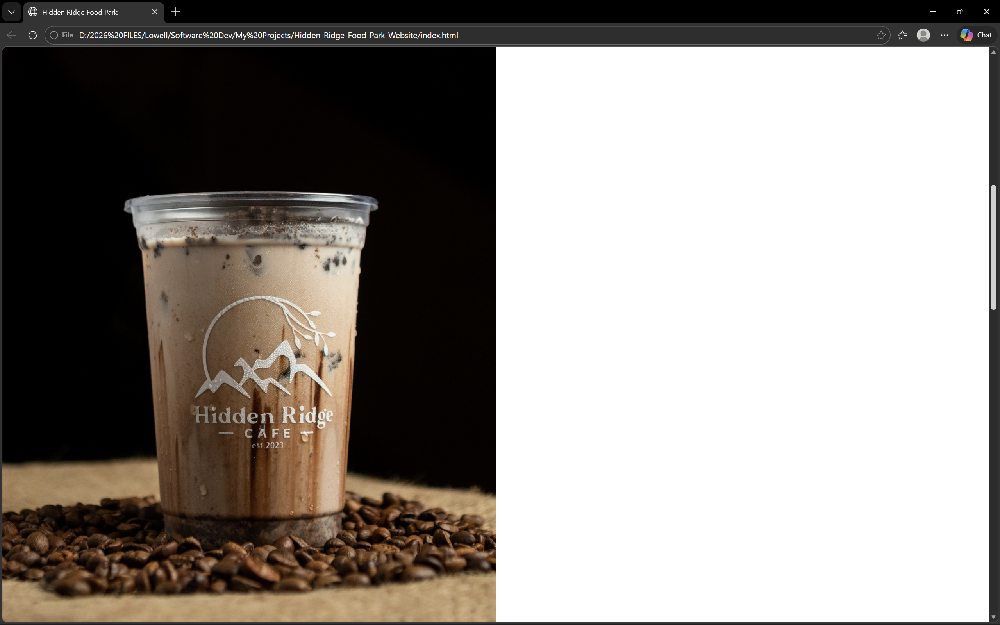
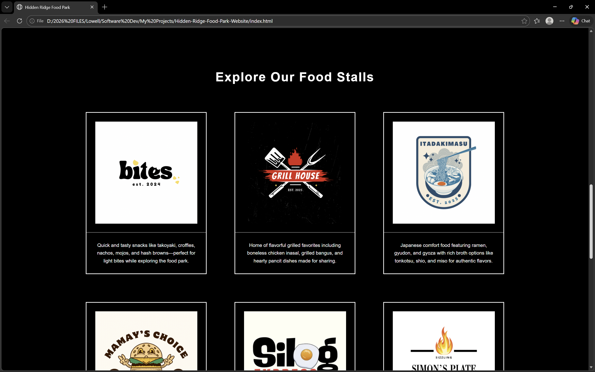
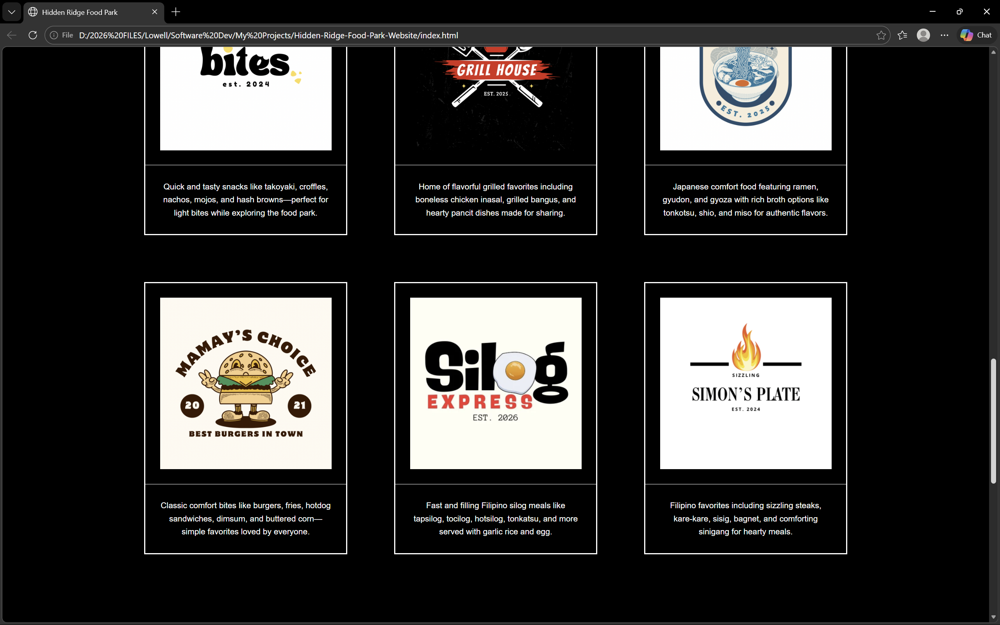
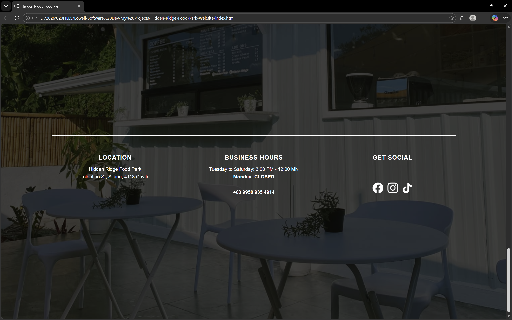

# Hidden Ridge Food Park Website

A simple, interactive website for Hidden Ridge Food Park built using **HTML, CSS, and JavaScript**.

This project demonstrates front-end structure, UI layout implementation, and JavaScript-based interactivity, including a multi-section layout with hero, cafe, food stalls, and end sections.

---

## Current Interactivity

- **"Dine with us" button**: Displays a popup showing the food park’s operating hours.
- **"See our menu" button**: Smoothly scrolls the page to the food stalls section.
- Hovering over food stall cards slightly enlarges the card for a visual effect.
- Buttons respond instantly to user interaction using JavaScript event handling.

---

## Website Sections

1. **Hero Section** – Features the Hidden Ridge logo and main call-to-action buttons.
2. **Cafe Section** – A two-column draft layout: left side with a drink image, right side reserved for future content.
3. **Food Stalls Section** – Six portrait-style stall cards showing logo and description; three per row, responsive spacing.
4. **End Section** – Background image, horizontal separator line, and three columns showing location, business hours, and social media.

---

## Screenshots

### Homepage


### Cafe Draft Section


### Food Stalls Section (Part 1)


### Food Stalls Section (Part 2)


### End Section


---

## Design & Development Process

The website layout and visual structure were first prototyped using **Canva** to plan spacing, alignment, and visual hierarchy before implementation.

The design was then developed using **HTML and CSS** for structure and styling, while **JavaScript** was used to implement event-driven interactivity and smooth scrolling behavior.

AI-assisted development tools were used as a coding aid to help with debugging, refining layout structure, and improving overall development workflow efficiency.

---

## How to Run

1. Clone the repository:
```bash
git clone https://github.com/SE-Looweh05/Hidden-Ridge-Food-Park-Website.git
