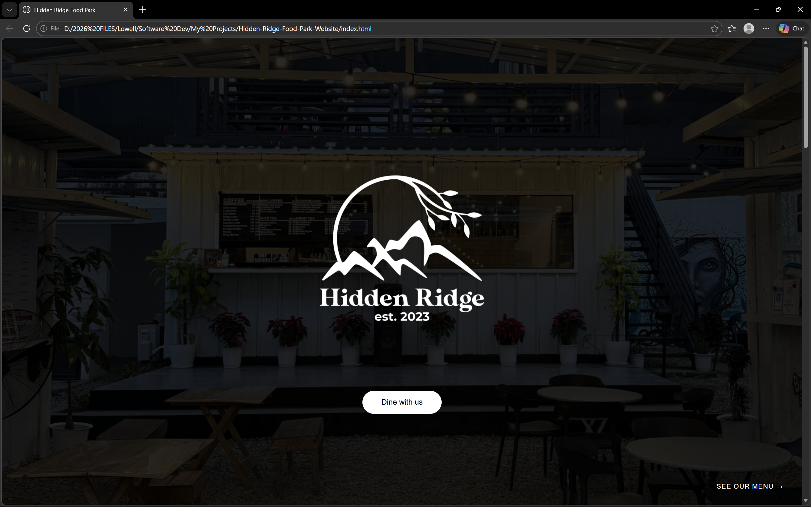

# Hidden Ridge Food Park Website

A simple, interactive website for Hidden Ridge Food Park. Built with HTML, CSS, and JavaScript.  

Currently, the website showcases a **homepage design** with interactive buttons.  

---

## Current Interactivity
- **"Dine with us" button**: Shows a popup with the food park’s operating hours.  
- **"See our menu" button**: Shows a popup saying “Coming soon”.  
- Buttons respond instantly, giving users visual feedback on click.  

---

## Screenshots

### Homepage


### "Dine with us" Button Popup


### "See our menu" Button Popup


---

## How to Run
1. Clone the repository:
```bash
git clone https://github.com/SE-Looweh05/Hidden-Ridge-Food-Park-Website.git
